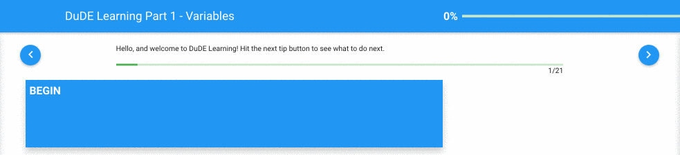
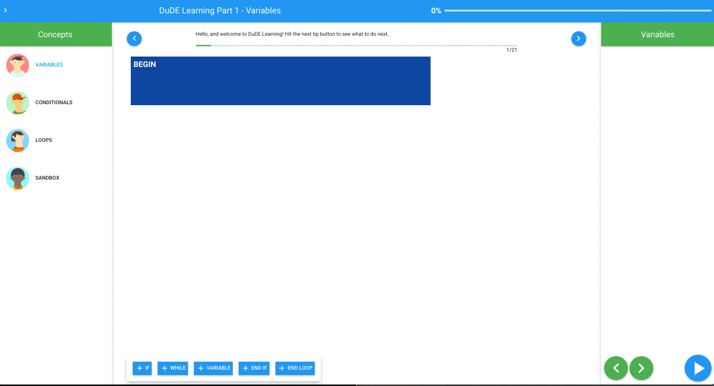
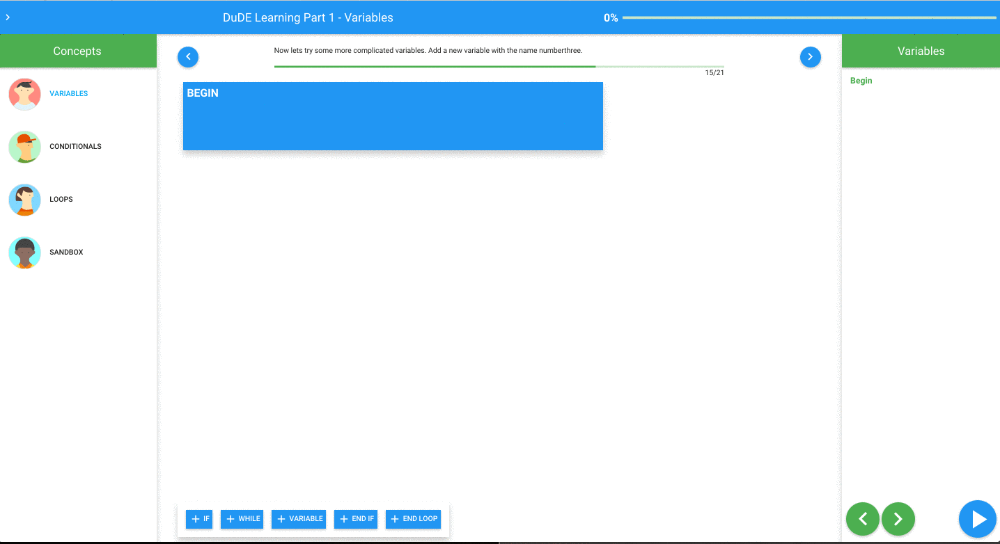
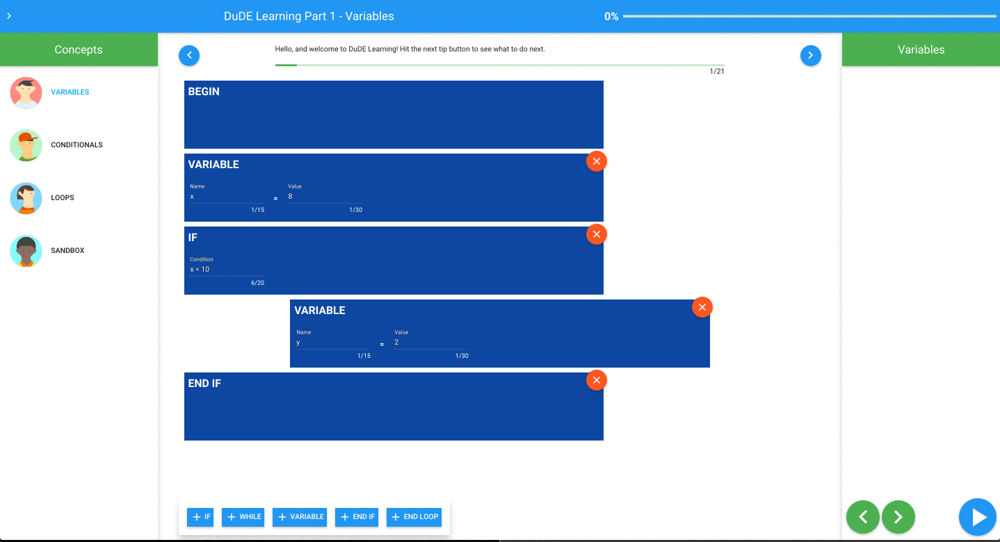

# DuDE Programming Tutorial

#### Description

  - DuDE is a high level programming tutorial to teach children the basics of variable assignment, conditional statements and loops. It is a drag and drop block format with a built in custom debugger to go forward and backwards through each step of the program.
  - There are 3 modules with step by step intrustions as well as a sandbox for playing around.
  - Here are a few examples

###### Tutorial Instructions
  

###### Creating Program from Blocks
  

###### Reordering Blocks
  

###### Using Debugger
  

#### Running Locally

  - Clone repo `git clone <repo url>`
  - Start up backend and frontend

###### Backend

 - Must have pip installed
 - `cd backend/`
 - `sudo pip install -r requirements.txt`
 - `./app.py`
 - backend will be running on `http://localhost:5000`

###### Frontend

  - Must have node installed
  - `cd frontend/`
  - `npm install`
  - `bower install`
  - `npm start`
  - frontend will be running on `http://localhost:8111`

### Contributors

- Zach Waterfield 
 * [@zlwaterfield](https://github.com/zlwaterfield "Zach Waterfield")
 * [zlwaterfield.com](http://zlwaterfield.com)
- Jack Forbes
 * [@jackforbes](https://github.com/JackForbes "Jack Forbes")
 * [jackforbes.net](http://jackforbes.net)
- Jackson Prange
 * [@jprange](https://github.com/Jprange)
- Evgeny Gorchakov
 * [@evgorchakov](https://github.com/evgorchakov)

